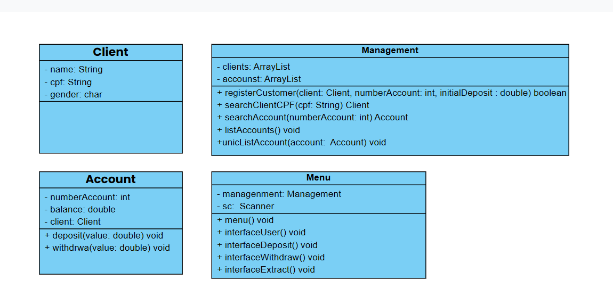

# 💰 Desafio - Sistema Bancário em Java
Este projeto é um sistema bancário simples, desenvolvido como desafio pessoal para praticar os conceitos de programação orientada a objetos (POO) em Java. O sistema permite o cadastro de clientes, criação de contas, depósitos, saques e consultas de saldo e contas.

## 📋 Funcionalidades

✔️ Cadastro de cliente com ou sem depósito inicial

✔️ Criação de contas bancárias vinculadas ao CPF

✔️ Depósito em conta

✔️ Saque de valores

✔️ Consulta de saldo (extrato)

✔️ Listagem de contas existentes

## 📊  Diagrama UML 

*Diagrama UML representando as classes principais e seus relacionamentos no sistema bancário.*

## 📌 Regras de Negócio
- Cada cliente pode possuir apenas uma conta bancária associada ao seu CPF.

- Apenas depósitos com valor positivo são aceitos.

- Saques são realizados mesmo que o saldo fique negativo (sem validação de limite).

## 💻 Interface 
```bash
--- Menu do Banco ---
1. Cadastrar cliente com conta
2. Depositar
3. Sacar
4. Extrato
5. Listar contas
0. Sair
Escolha uma opção: 
```

## 🔗 Como Executar o Projeto

### ✅ Pré-requisitos
- Java JDK 17
- Git
- Intellij IDEA


### 💻 Execução Local

#### 1. Clone o repositório pelo **IntelliJ IDEA**:

- Abra o IntelliJ IDEA.

-  **File > New > Project from Version Control**.

- Cole o link do repositório:
```bash
https://github.com/HenzoBragas/SistemaBancario.git
```
- Clique em Clone.

#### 2. Execute a aplicação
- Abra a classe principal **Main** 
- Execute a aplicação.

Se estiver tudo certo, verá no terminal:
```bash
=======================================================
--- Menu do Banco ---
1. Cadastrar cliente com conta
2. Depositar
3. Sacar
4. Extrato
5. Listar contas
0. Sair
Escolha uma opção: 
=======================================================
```


## 💻 Tecnologias Utilizadas

- Java 17
- IntelliJ IDEA 
- Maven
